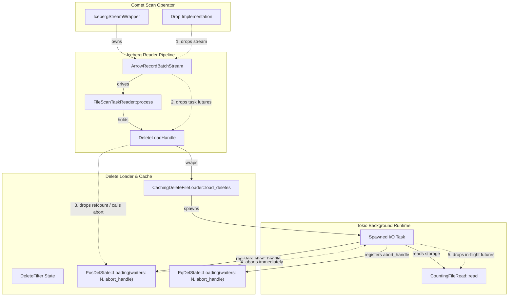

# Design: Delete File Loader Resource Ownership and Cancellation Fix

## 1. Defect Verification

**Verdict:** **CONFIRMED**

### 1.1 Source-Level Evidence

1. **Discarded JoinHandle & Detached Task:**
   - Location: [`crates/iceberg/src/arrow/caching_delete_file_loader.rs:209`](file:///home/unik/Coding/rust/rp-work/iceberg-nanfix/crates/iceberg/src/arrow/caching_delete_file_loader.rs#L209)
   - Code: `self.runtime.io().spawn(async move { ... });`
   - The returned `JoinHandle` is discarded with a semicolon.
2. **Runtime Wrapper Detaches on Drop:**
   - Location: [`crates/iceberg/src/runtime/mod.rs:37-74`](file:///home/unik/Coding/rust/rp-work/iceberg-nanfix/crates/iceberg/src/runtime/mod.rs#L37-L74)
   - `JoinHandle<T>` wraps `tokio::task::JoinHandle<T>` without an abort-on-drop implementation or an exposed `abort()` method. In Tokio, dropping a `JoinHandle` detaches the task; it continues running independently in the background runtime thread pool.
3. **Scan Receiver Lifetime is Scoped to Task Processing:**
   - Location: [`crates/iceberg/src/arrow/reader/pipeline.rs:203,520`](file:///home/unik/Coding/rust/rp-work/iceberg-nanfix/crates/iceberg/src/arrow/reader/pipeline.rs#L203-L520)
   - `delete_filter_rx: Receiver<Result<DeleteFilter>>` is held as a local variable inside `FileScanTaskReader::process`. Dropping the scan stream drops the active task futures, dropping `delete_filter_rx`. However, closing the receiver does not cancel or terminate the detached I/O task.
4. **No Cancellation Token Exists:**
   - Inspection of `crates/iceberg` confirms that no `CancellationToken` or cooperative cancellation mechanism exists. The spawned task runs `while let Some(item) = results_stream.next().await` without checking `tx.is_closed()` or observing consumer cancellation.
5. **Metrics Underreporting in Comet:**
   - Location: [`native/core/src/execution/operators/iceberg_scan.rs:491`](file:///home/unik/Coding/rust/rp-work/comet/native/core/src/execution/operators/iceberg_scan.rs#L491)
   - `IcebergStreamWrapper::drop` executes:
     ```rust
     self.inner = None;
     self.report_scan_metrics();
     ```
   - Setting `self.inner = None` drops the scan stream and task futures. Comet immediately captures its final snapshot of `scan_metrics.bytes_read()` via `self.report_scan_metrics()` and exports it to DataFusion / Spark.
   - The detached I/O task continues opening and reading delete files via `CountingFileRead::read` ([`crates/iceberg/src/arrow/scan_metrics.rs:44`](file:///home/unik/Coding/rust/rp-work/iceberg-nanfix/crates/iceberg/src/arrow/scan_metrics.rs#L44)), which increments `scan_metrics.bytes_read()`. Because Comet's drop sequence has already concluded, all subsequent bytes read are permanently unobserved and underreported.
6. **Bypassed Waiter Completion Guarantee:**
   - Location: [`crates/iceberg/src/arrow/delete_filter.rs:106,169`](file:///home/unik/Coding/rust/rp-work/iceberg-nanfix/crates/iceberg/src/arrow/delete_filter.rs#L106-L169)
   - Commit `315f8f140` added `PosDelLoadGuard::drop` and dropped equality `Sender` handling to notify waiters with retryable errors on cancellation.
   - However, because the load owner is the detached background task on `runtime.io()`, neither `PosDelLoadGuard` nor `Sender` drops early on scan cancellation. They remain alive until the detached task completes or errors on its own schedule.

### 1.2 Cache Scoping Analysis

Trace of cache ownership and lifetime:
- `ArrowReaderBuilder::build()` ([`crates/iceberg/src/arrow/reader/mod.rs:188`](file:///home/unik/Coding/rust/rp-work/iceberg-nanfix/crates/iceberg/src/arrow/reader/mod.rs#L188)) instantiates a new `CachingDeleteFileLoader`, which invokes `DeleteFilter::new()` with a fresh, private `Arc<RwLock<DeleteFileFilterState>>`.
- `ArrowReader::read(self, ...)` takes `self` by value.
- In Comet, `IcebergScanExec::execute` ([`native/core/src/execution/operators/iceberg_scan.rs:338`](file:///home/unik/Coding/rust/rp-work/comet/native/core/src/execution/operators/iceberg_scan.rs#L338)) builds a brand new `ArrowReader` on every execution.
- Similarly, `TableScan::to_arrow` ([`crates/iceberg/src/scan/mod.rs:592`](file:///home/unik/Coding/rust/rp-work/iceberg-nanfix/crates/iceberg/src/scan/mod.rs#L592)) constructs a new reader per scan.
- **Conclusion:** The cache is **strictly scoped per `ArrowReader` (per scan)**. It is **NOT global** and is **never shared across scans**. When a scan drops, no other live reader in the process can access or benefit from that cache.

---

## 2. Evaluation of Architectural Options

### Option (d): Leave As-Is and Document
- **Premise:** Plausible only if the cache is shared across scans and background loading performs work useful to subsequent queries.
- **Evaluation:** Refuted by code verification. The cache is strictly per-scan. Post-cancellation reads consume network/disk I/O for data that is discarded immediately upon task completion, while silently skewing Comet's `bytes_scanned` metrics.
- **Verdict:** **REJECTED**.

### Option (b): Drop Guard / CancellationToken Checked Between Delete Files
- **Premise:** Provide cooperative cancellation by checking a token or `tx.is_closed()` in the loader loop.
- **Evaluation:**
  - Checking cancellation *between* delete files does not stop an in-flight read of a large Parquet delete file or Puffin blob.
  - `try_buffer_unordered(concurrency_limit_data_files)` eagerly initiates up to $N$ delete file reads concurrently. All in-flight requests continue downloading.
  - While stalled on slow I/O, `CountingFileRead` continues advancing `bytes_read` post-drop, failing to resolve the metrics gap.
- **Verdict:** **REJECTED**.

### Option (c): Run Delete Loading Inline in the Stream Future
- **Premise:** Avoid spawning background tasks entirely by making `load_deletes` an async future driven directly inside `FileScanTaskReader::process`.
- **Evaluation:**
  - *Parallelism loss:* `FileScanTaskReader::process` currently initiates `load_deletes` concurrently with `open_parquet_file` (which fetches Parquet footers and preloads page indices). Inlining sequentially serializes data file open and delete loading, adding 20–50ms remote storage latency per split. (Using `tokio::try_join!` within `process` could mitigate intra-split serialization, but still binds delete loading to that task's polling).
  - *Inter-task entanglement:* If Task 1 owns a shared delete file load inline and Task 1 encounters a data-file read error, dropping Task 1 cancels the inline future, triggering `PosDelLoadGuard::drop` and failing Task 2 (which is healthy and waiting on the delete file).
  - Alters public/crate-private signatures across `caching_delete_file_loader.rs` and `pipeline.rs`.
- **Verdict:** Suboptimal due to latency overhead and brittle cross-task fate-sharing.

### Option (a): Retain JoinHandle and Abort on Drop When Cache Entry Has No Remaining Waiters (Recommended)
- **Premise:** Maintain asynchronous task execution on `runtime.io()`, but track ownership via `AbortHandle`s and active waiter refcounts in `DeleteFilter`.
- **Evaluation:**
  - Preserves 100% of existing intra-task and inter-task I/O parallelism.
  - Immediate abort: Tokio's `AbortHandle::abort()` terminates the task immediately, instantly dropping nested storage futures (`FileRead::read`), stopping byte accumulation.
  - Waiter-aware refcounting: If Task 1 drops but Task 2 is waiting on the same file, the load continues. When the entire scan drops (all tasks drop), refcounts hit 0 and all orphaned loads are aborted immediately.
  - Native integration with commit `315f8f140`: Aborting an owned load with live waiters fires `PosDelLoadGuard::drop` / equality sender drop, ensuring waiters wake up with a retryable cancellation error and never hang.
- **Verdict:** **CHOSEN (RECOMMENDED)**.

---

## 3. Technical Design for Option (a)

### 3.1 Ownership and Component Architecture



### 3.2 Exact Functions and Data Structures to Change

#### 1. Runtime Wrapper ([`crates/iceberg/src/runtime/mod.rs`](file:///home/unik/Coding/rust/rp-work/iceberg-nanfix/crates/iceberg/src/runtime/mod.rs))
Expose `abort()` and `abort_handle()` on `JoinHandle`:
```rust
impl<T> JoinHandle<T> {
    pub fn abort(&self) {
        self.0.abort();
    }
    pub fn abort_handle(&self) -> tokio::task::AbortHandle {
        self.0.abort_handle()
    }
}
```

#### 2. Delete Filter State ([`crates/iceberg/src/arrow/delete_filter.rs`](file:///home/unik/Coding/rust/rp-work/iceberg-nanfix/crates/iceberg/src/arrow/delete_filter.rs))
Augment `PosDelState` and `EqDelState` with active waiter tracking and abort handles:
```rust
struct PosDelLoadingState {
    notify: Arc<Notify>,
    waiters: usize,
    abort_handle: Option<tokio::task::AbortHandle>,
}

enum PosDelState {
    Loading(PosDelLoadingState),
    Loaded,
    Failed(Arc<Error>),
}
```

Update `try_start_pos_del_load`:
- When inserting `Loading`: initialize `waiters = 1`, `abort_handle = None`.
- When encountering an existing `Loading`: increment `loading.waiters += 1`. Return `PosDelLoadAction::WaitFor(PosDelWaitGuard { ... })`.
- Add `register_pos_del_abort_handle(&self, file_path: &str, handle: tokio::task::AbortHandle)`:
  - If `Loading`: store `handle`. If `waiters == 0`, immediately invoke `handle.abort()`.

Add RAII Waiter Guard (`PosDelWaitGuard`):
```rust
pub(crate) struct PosDelWaitGuard {
    filter: DeleteFilter,
    file_path: String,
    notified: OwnedNotified,
    completed: bool,
}

impl PosDelWaitGuard {
    pub(crate) async fn wait(mut self) -> Result<()> {
        self.notified.await;
        self.completed = true;
        self.filter.positional_delete_load_result(&self.file_path)
    }
}

impl Drop for PosDelWaitGuard {
    fn drop(&mut self) {
        if !self.completed {
            self.filter.decrement_pos_del_waiter(&self.file_path);
        }
    }
}
```

Implement `decrement_pos_del_waiter`:
```rust
fn decrement_pos_del_waiter(&self, file_path: &str) {
    let mut state = self.state.write().unwrap();
    if let Some(PosDelState::Loading(loading)) = state.positional_deletes.get_mut(file_path) {
        loading.waiters = loading.waiters.saturating_sub(1);
        if loading.waiters == 0 {
            if let Some(handle) = loading.abort_handle.take() {
                handle.abort();
            }
            state.positional_deletes.remove(file_path);
        }
    }
}
```

Equip `PosDelLoadGuard::drop`:
- Decrement `waiters`. If `waiters == 0`, abort in-flight task and remove entry.
- If `waiters > 0` (other tasks waiting), execute existing logic: mark `PosDelState::Failed("cancelled")` and fire `notify_waiters()`.

Apply symmetrical waiter refcounting and `AbortHandle` registration to `EqDelState`.

#### 3. Caching Delete File Loader ([`crates/iceberg/src/arrow/caching_delete_file_loader.rs`](file:///home/unik/Coding/rust/rp-work/iceberg-nanfix/crates/iceberg/src/arrow/caching_delete_file_loader.rs))
Wrap the return of `load_deletes` in `DeleteLoadHandle`:
```rust
pub(crate) struct DeleteLoadHandle {
    rx: Receiver<Result<DeleteFilter>>,
    abort_handle: tokio::task::AbortHandle,
}

impl Future for DeleteLoadHandle {
    type Output = Result<Result<DeleteFilter>, tokio::sync::oneshot::error::RecvError>;
    fn poll(mut self: Pin<&mut Self>, cx: &mut Context<'_>) -> Poll<Self::Output> {
        Pin::new(&mut self.rx).poll(cx)
    }
}

impl Drop for DeleteLoadHandle {
    fn drop(&mut self) {
        self.abort_handle.abort();
    }
}
```
In `load_deletes`:
```rust
let join_handle = self.runtime.io().spawn(async move { ... });
DeleteLoadHandle {
    rx,
    abort_handle: join_handle.abort_handle(),
}
```
Inside the task stream loop, pass the `abort_handle` down to `register_pos_del_abort_handle` and `register_eq_del_abort_handle`.

#### 4. Reader Pipeline ([`crates/iceberg/src/arrow/reader/pipeline.rs`](file:///home/unik/Coding/rust/rp-work/iceberg-nanfix/crates/iceberg/src/arrow/reader/pipeline.rs))
In `FileScanTaskReader::process`:
Hold `delete_load_handle: DeleteLoadHandle` and await `delete_load_handle.await.unwrap()?`. If `process` drops early, the drop guard executes cleanly.

---

## 4. Interaction with Waiter-Completion Guarantees

Commit `315f8f140` established the invariant that no waiter may hang if a load owner terminates prematurely. The proposed refcounting design preserves and reinforces this contract:

1. **Scan-Wide Cancellation (Common Path):**
   - When a scan is cancelled or LIMIT is reached, all active data-file tasks drop concurrently.
   - Owners and waiters both drop their guards (`PosDelLoadGuard` and `PosDelWaitGuard`).
   - Every file's `waiters` count drops to 0.
   - `abort_handle.abort()` fires, halting background storage I/O immediately.
2. **Owner Drop with Surviving Waiter (Partial Cancellation):**
   - If Task 1 drops while Task 2 is waiting on the same delete file, `loading.waiters` remains $\ge 1$.
   - If the task was spawned per delete file or if Task 1's abort fires, `PosDelLoadGuard::drop` marks the entry as `PosDelState::Failed("Positional delete loading was cancelled before completion").with_retryable(true)` and calls `notify.notify_waiters()`.
   - Task 2 wakes up immediately, receives the typed retryable error, and fails gracefully. **No waiter hangs.**

---

## 5. Comet Metrics Accuracy Guarantee

Under the existing defect:
1. Scan stream drops $\rightarrow$ `IcebergStreamWrapper::drop` executes $\rightarrow$ `self.inner = None` drops stream.
2. `self.report_scan_metrics()` reads `scan_metrics.bytes_read()`.
3. Detached task on `runtime.io()` continues running $\rightarrow$ `CountingFileRead::read` increments `scan_metrics.bytes_read()`.
4. Subsequent bytes read are permanently unobserved.

Under Option (a):
1. Scan stream drops $\rightarrow$ `DeleteLoadHandle::drop` calls `abort_handle.abort()`.
2. Tokio immediately aborts the spawned future. In-flight `FileRead::read` futures are dropped synchronously.
3. No further storage reads occur. `CountingFileRead::read` cannot execute.
4. `self.report_scan_metrics()` captures the exact final total. Zero unrecorded bytes.

---

## 6. Deterministic Regression Test Design

### 6.1 Test Setup
Implement `GatedFileRead` / `ChannelControlledFileIO`:
- Wrap a memory-backed delete file in a `FileRead` implementation gated by Tokio oneshot channels:
  - `gate_opened: Arc<AtomicBool>`
  - `read_started_tx: mpsc::Sender<()>`
  - `read_release_rx: oneshot::Receiver<()>`
- When `read(range)` is invoked on the delete file:
  1. Emit `read_started_tx.send(())` to notify the test harness that delete loading has reached the I/O stage.
  2. Await `read_release_rx.await`.
  3. When released, return bytes and record read.

### 6.2 Test Execution Sequence
1. Construct an `ArrowReader` with a scan task referencing a positional delete file and an equality delete file backed by `GatedFileRead`.
2. Build the Comet `IcebergStreamWrapper` (or execute `reader.read(tasks)` directly).
3. Poll the stream once. The reader initiates `process(task)` and starts `load_deletes`.
4. Await `read_started_rx.recv()`. The delete loader is now suspended inside `CountingFileRead::read`.
5. Capture baseline bytes: `initial_reported_bytes = scan_metrics.bytes_read()`.
6. Drop the stream wrapper: `drop(wrapped_stream)`.
   - In Comet, this triggers `self.inner = None; self.report_scan_metrics();`.
   - The test records the final reported metric: `final_reported = metrics.bytes_scanned.value()`.
7. Release the storage gate: `read_release_tx.send(())`.
8. Wait for executor idle / advance Tokio time.

### 6.3 Assertions
- **Today (Fails):** The detached task wakes up upon gate release, finishes reading the delete file, increments `scan_metrics.bytes_read()`, and parses the Parquet file.
  - Failure check: `scan_metrics.bytes_read() > initial_reported_bytes`, while `final_reported == initial_reported_bytes` (underreported leak).
- **With Option (a) Fix (Passes):**
  - Because `drop(wrapped_stream)` aborted the background task, the gated future is dropped before release.
  - Releasing the gate does not resume any task.
  - `scan_metrics.bytes_read() == initial_reported_bytes`.
  - Zero post-drop I/O is performed.
