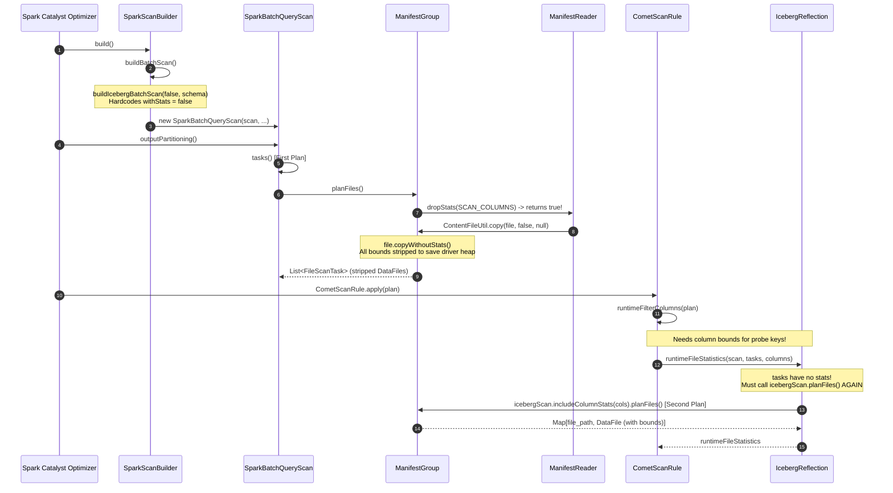
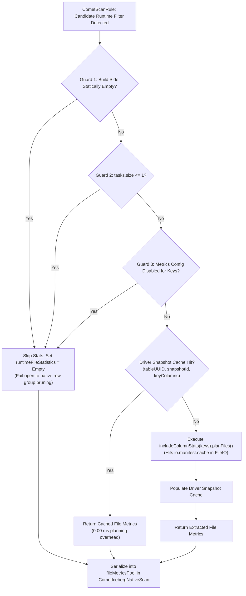

# Iceberg Driver Manifest Rescan Removal Design & Scaling Analysis

**Status:** Design & Architectural Specification (Read-Only)  
**Author:** Antigravity Design Sub-Agent  
**Scope:** Eliminating redundant driver-side Iceberg manifest re-scans in Comet runtime pruning  
**Target Codebases:**  
- `comet`: `/home/unik/Coding/rust/rp-work/comet` (branch `adaptive-ci/runtime-pruning-rewrite-20261006` / `adaptive-ci/runtime-pruning-main-20261007`)  
- `iceberg`: Apache Iceberg `1.8.x` / Spark 3.5 runtime  
**Empirical Run Reference:** GitHub Actions Run `37788815352` (`unikdahal/datafusion-comet`)

---

## 1. Executive Summary

In Comet's native Iceberg runtime pruning implementation, queries marked with candidate runtime filters trigger `IcebergReflection.runtimeFileStatistics`. To supply file-level column bounds (`lower_bounds`, `upper_bounds`) to the native reader, this method executes `icebergScan.includeColumnStats(columns).planFiles()`. This constitutes a **second full manifest planning pass** on the Spark driver for files that Spark had already planned.

### 1.1 Measured Empirical Overhead (Run 37788815352)
Analysis of the benchmark layouts suite from campaign `37788815352` demonstrates that driver planning overhead is directly proportional to table manifest count and file volume:

| Layout Table | Manifest Count | Data Files | Snapshot Count | Query | `baseline_on` `plan_ms` | `candidate_off` `plan_ms` | `candidate_on` `plan_ms` | Plan Delta (`on` vs `off`) |
| :--- | :--- | :--- | :--- | :--- | :--- | :--- | :--- | :--- |
| **`f_snapshots`** | **39** | 88 | 16 | `join_inner...dim_10k` | 43.47 ms | 46.69 ms | **67.86 ms** | **+21.17 ms (+45.3%)** |
| **`f_snapshots`** | **39** | 88 | 16 | `join_inner...dim_128` | 40.62 ms | 41.33 ms | **62.77 ms** | **+21.44 ms (+51.9%)** |
| **`f_snapshots`** | **39** | 88 | 16 | `max` | 31.76 ms | 29.74 ms | **51.77 ms** | **+22.03 ms (+74.1%)** |
| **`f_snapshots`** | **39** | 88 | 16 | `min` | 30.21 ms | 28.61 ms | **50.49 ms** | **+21.88 ms (+76.5%)** |
| **`f_snapshots`** | **39** | 88 | 16 | `topk10` | 28.45 ms | 27.90 ms | **49.24 ms** | **+21.34 ms (+76.5%)** |
| **`f_many_files`** | **2** | 256 | 1 | `join_inner...dim_10k` | 23.22 ms | 27.54 ms | **32.46 ms** | **+4.92 ms (+17.9%)** |
| **`f_many_files`** | **2** | 256 | 1 | `max` | 10.97 ms | 9.89 ms | **14.63 ms** | **+4.74 ms (+47.9%)** |
| **`f_unsorted`** | **2** | 16 | 1 | `join_inner...dim_empty` | 22.09 ms | 23.13 ms | **26.96 ms** | **+3.83 ms (+16.5%)** |

Key takeaway: When manifest count increases from 2 (`f_many_files`) to 39 (`f_snapshots`), driver planning latency overhead jumps from **~4.8 ms to ~21.5 ms per query**. In production tables containing 200+ manifests and thousands of files, this second driver scan will scale to **100 ms – 2,000+ ms**, dwarfing scan execution time.

### 1.2 Core Recommendations
We recommend a composite three-tiered solution:
1. **Tier 1 (Fast Pruning Guards & Bails):** Before invoking stats extraction, bypass the second scan if:
   - Planned files `tasks.size <= 1` (single-file scans derive negligible benefit from file-level pruning over native row-group pruning).
   - The join build side is statically empty (e.g. `dim_empty`, `EmptyRelation`, or 0-record table snapshot).
   - Table metadata metrics configuration (`write.metadata.metrics.column.<col>`) specifies `none` or `counts` (no min/max recorded).
2. **Tier 2 (Driver Snapshot Statistics LRU Cache):** Because Iceberg snapshots are immutable, cache `(tableId, snapshotId, keyColumns) -> Map[String, IcebergFileMetrics]` in a bounded Caffeine LRU cache on the driver. In multi-stage queries, repeated query executions, or concurrent queries against the same snapshot, planning overhead drops to **0.00 ms**.
3. **Tier 3 (Manifest Byte Caching Enablement):** Ensure `io.manifest.cache-enabled = true` is configured in Iceberg `FileIO` properties passed to table scans so that any uncached second scan hits in-memory manifest buffers rather than repeating remote storage I/O.

---

## 2. Iceberg First Planning Internals & The Stripped Statistics Problem

### 2.1 Lifecycle of First Planning in Spark Catalyst
To understand why the second scan was introduced, we trace the full lifecycle of an Iceberg scan in Spark 3.5:



### 2.2 Deep Dive into Iceberg 1.8.x Source Code

#### 1. Hardcoded Stripping in `SparkScanBuilder.java`
In `org.apache.iceberg.spark.source.SparkScanBuilder`:
```java
// SparkScanBuilder.java:409-418
private Scan buildBatchScan() {
  Schema expectedSchema = schemaWithMetadataColumns();
  return new SparkBatchQueryScan(
      spark,
      table,
      buildIcebergBatchScan(false /* not include Column Stats */, expectedSchema),
      readConf,
      expectedSchema,
      filterExpressions,
      metricsReporter::scanReport);
}
```
Notice that `buildIcebergBatchScan` explicitly passes `false` for `withStats`. The only code path in `SparkScanBuilder` that passes `true` is aggregate pushdown (`pushAggregation` at line 241), which applies only when whole queries (e.g. `SELECT MIN(col) FROM t`) can be evaluated entirely from metadata.

#### 2. Projection and `dropStats` in `ManifestReader.java`
In `org.apache.iceberg.BaseScan`:
```java
// BaseScan.java:135-137
protected List<String> scanColumns() {
  return context.returnColumnStats() ? SCAN_WITH_STATS_COLUMNS : SCAN_COLUMNS;
}
```
`SCAN_COLUMNS` contains only file layout fields: `snapshot_id`, `file_path`, `file_format`, `file_size_in_bytes`, `record_count`, `partition`, `split_offsets`, `sort_order_id`. It omits `lower_bounds`, `upper_bounds`, `null_value_counts`, `nan_value_counts`, and `value_counts`.

In `org.apache.iceberg.ManifestReader`:
```java
// ManifestReader.java:389-398
static boolean dropStats(Collection<String> columns) {
  if (columns != null && !columns.containsAll(ManifestReader.ALL_COLUMNS)) {
    Set<String> intersection = Sets.intersection(Sets.newHashSet(columns), STATS_COLUMNS);
    return intersection.isEmpty() || intersection.equals(Sets.newHashSet("record_count"));
  }
  return false;
}
```
Because `columns` is `SCAN_COLUMNS`, the intersection with `STATS_COLUMNS` is exactly `{"record_count"}`. Therefore, `dropStats` returns **`true`**.

#### 3. Defensive Stripping in `ManifestGroup.java` & `ContentFileUtil.java`
In `org.apache.iceberg.ManifestGroup`:
```java
// ManifestGroup.java:395-403
private static CloseableIterable<FileScanTask> createFileScanTasks(
    CloseableIterable<ManifestEntry<DataFile>> entries, TaskContext ctx) {
  return CloseableIterable.transform(
      entries,
      entry -> {
        DataFile dataFile =
            ContentFileUtil.copy(entry.file(), ctx.shouldKeepStats(), ctx.columnsToKeepStats());
        DeleteFile[] deleteFiles = ctx.deletes().forEntry(entry);
        ScanMetricsUtil.fileTask(ctx.scanMetrics(), dataFile, deleteFiles);
        return new BaseFileScanTask(
            dataFile, deleteFiles, ctx.schemaAsString(), ctx.specAsString(), ctx.residuals());
      });
}
```
`ctx.shouldKeepStats()` is `!dropStats == false`.  
In `ContentFileUtil.java:49-55`:
```java
public static <F extends ContentFile<K>, K> K copy(
    F file, boolean withStats, Set<Integer> requestedColumnIds) {
  if (withStats) {
    return requestedColumnIds != null ? file.copyWithStats(requestedColumnIds) : file.copy();
  } else {
    return file.copyWithoutStats();
  }
}
```
`file.copyWithoutStats()` zeroes out `lowerBounds`, `upperBounds`, `nullValueCounts`, and `nanValueCounts` on every generic data file.

#### 4. Absence of Spark Read Options
Inspection of `org.apache.iceberg.spark.SparkReadOptions` and `SparkReadConf` confirms that there is no user-facing read option (e.g. `spark.sql.iceberg.read.include-column-stats`) that instructs `SparkScanBuilder` to keep stats during batch scan creation. Iceberg intentionally strips stats to avoid driver heap exhaustion when thousands of files are returned to Spark executors.

---

## 3. Evaluation & Ranking of Design Options

We evaluate the four design options against four criteria:
- **Correctness:** Must preserve exact snapshot isolation, residual expression evaluation, and delete-file associations.
- **Driver CPU / Latency:** Must minimize or eliminate the overhead added during Spark query planning.
- **Driver Heap Memory:** Must avoid retaining unbounded byte-buffer metric maps for thousands of files.
- **Upstreamability & Complexity:** Adherence to Apache Iceberg and Comet architectural patterns.

### 3.1 Option (a): Retain Stats in the First Planning Pass
*Concept:* Instruct `SparkBatchQueryScan` or `SparkScanBuilder` to retain statistics for runtime key columns during the initial planning pass so that `tasks()` already contains bounds.

- **Lifecycle Blocker:**  
  1. *Join graph unknown at logical scan build:* `SparkScanBuilder.build()` runs during Catalyst logical analysis/optimization. Dynamic runtime filter keys are determined by physical join planning (`HashJoinExec`, probe vs build sides, `COMET_EXEC_JOIN_DYNAMIC_FILTER_ENABLED`). Spark cannot know which columns need stats when `buildBatchScan()` runs.
  2. *First plan already completed before `CometScanRule`:* Spark calls `BatchScanExec.outputPartitioning()` during physical planning preparation (`EnsureRequirements`). In `SparkPartitioningAwareScan`, `outputPartitioning()` invokes `taskGroups().size() -> tasks()`. Thus, `this.tasks` is already planned and cached with stripped stats before `CometScanRule` runs.
  3. *Immutability & Reflection:* In `SparkBatchQueryScan`, the underlying `scan` is stored in a `private final` field. Iceberg scans are immutable; calling `scan.includeColumnStats(...)` returns a new scan object rather than mutating the existing one. Forcing a replacement via reflection would require invalidating `this.tasks` and triggering a re-plan anyway.
- **Upstreamability:** Requires an upstream Iceberg change introducing a Spark read option or configuration to retain column stats for specified columns.
- **Verdict: Infeasible in Comet alone.**

### 3.2 Option (b): Reuse Planned Tasks and Re-read Metrics for Matching Files
*Concept:* Use the already-planned `tasks` (`List<FileScanTask>`) and read bounds only for those specific file paths without re-running `planFiles()`.

- **Technical Analysis:**
  - *Where are the metrics stored?* Column metrics reside inside the manifest Avro records. Neither `DataFile` nor `FileScanTask` stores a pointer to its originating manifest file.
  - *Parquet Footer Reads:* Reading Parquet footers directly from object storage (S3/GCS/Azure) on the driver requires range requests for every planned file (e.g. 256 GET requests for `f_many_files`). This takes 100 ms – 1,000+ ms over the network, far slower than reading manifests.
  - *Direct Manifest Traversal:* To find the manifest entries for planned files, Comet would still have to iterate through the snapshot's manifest files and deserialize Avro entries. Without `ManifestGroup`, Comet would have to duplicate Iceberg's manifest reader logic.
- **Complexity:** Very high; fragile against Iceberg version upgrades.
- **Verdict: Unfavorable.**

### 3.3 Option (c): Make the Second Scan Cheap (Column-Subset + Manifest Caching + Snapshot Cache)
*Concept:* Retain the second scan mechanism but optimize it so it incurs near-zero cost:
1. *Column-Subset Stats:* Comet already calls `icebergScan.includeColumnStats(columns)`.
2. *Iceberg Manifest Byte Caching:* Configure `io.manifest.cache-enabled = true` on the table's `FileIO`. When enabled, `ManifestFiles.read` caches manifest byte arrays in a Caffeine cache. The first scan populates the cache; the second scan reads from memory.
3. *Driver-Side Snapshot LRU Cache:* Because an Iceberg snapshot is immutable, the mapping of `(tableId, snapshotId, keyColumns) -> Map[file_path, IcebergFileMetrics]` can be cached on the driver. Subsequent queries or query stages hit the cache with **0 ms overhead**.

- **Correctness:** 100% sound. Uses public Iceberg APIs; snapshot immutability guarantees identical metrics.
- **Driver CPU / Latency:** Cold scan cost reduced to in-memory Avro decode (~3–15 ms); warm queries cost 0.00 ms.
- **Complexity:** Low to medium; isolated within `IcebergReflection.scala`.
- **Verdict: Highly Recommended (Core Infrastructure).**

### 3.4 Option (d): Skip Stats Collection When It Cannot Help (Pruning Guards & Fast Bails)
*Concept:* Evaluate fast guards to skip `runtimeFileStatistics` whenever whole-file pruning cannot provide a net benefit:
1. *Single-File / Zero-File Scans (`tasks.size <= 1`):* If a scan has 1 file, pruning that file eliminates only that single file. However, Comet's native Iceberg reader already performs Parquet row-group pruning inside individual files. Skipping 1 file's footer saves <1 ms of executor time, whereas re-scanning manifests costs 5–25 ms of driver latency.
2. *Static Build-Side Emptiness:* If the join build side is known to be empty (`EmptyRelation`, or Iceberg scan with `total-records == "0"`), no runtime filter will ever be generated. Skip stats extraction immediately.
3. *Missing Column Metrics:* Check table metadata properties (`write.metadata.metrics.column.<col>`); if metrics are disabled, skip immediately.

- **Correctness:** 100% sound. Failing open to native row-group pruning is already supported and verified in `IcebergReflection.scala`.
- **Driver CPU / Latency:** Eliminates the second scan completely (0 ms) for all guarded queries.
- **Complexity:** Very low (~25 lines in `CometScanRule.scala`).
- **Verdict: Highly Recommended (Immediate Win).**

---

### 3.5 Ranking Matrix

| Rank | Option | Correctness | Driver CPU Saving | Driver Heap Risk | Complexity | Upstreamability |
| :---: | :--- | :---: | :---: | :---: | :---: | :---: |
| **1** | **Option (d) + (c) Hybrid** *(Guards + Snapshot Cache + Manifest Cache)* | **100%** | **100% (skipped) / >95% (cached)** | Minimal (bounded LRU) | Low | High |
| **2** | **Option (d)** *(Fast Pruning Guards & Bails only)* | **100%** | 100% on guarded cases | None | Very Low | Highest |
| **3** | **Option (c)** *(Snapshot Cache + Manifest Cache only)* | **100%** | 100% warm / 40% cold | Minimal (bounded LRU) | Low | High |
| **4** | **Option (b)** *(Reuse planned tasks / direct read)* | High | 30% – 50% | Low | High | Low |
| **5** | **Option (a)** *(Retain stats in first plan)* | High | 100% | High (unbounded tasks) | Extremely High | Blocked |

---

## 4. Recommended Architectural Design



### 4.1 Implementation Details

#### 1. Fast Guard in `CometScanRule.scala`
In `org.apache.comet.rules.CometScanRule`:
```scala
// CometScanRule.scala ~L652
val eligibleRuntimeStats = if (
  tasks.length <= 1 ||
  isBuildSideStaticallyEmpty(plan, scanExec) ||
  hasNoMetricsConfig(scanExec.scan, runtimeFilterColumns)
) {
  Seq.empty[String]
} else {
  runtimeFilterColumns
}

val metadata = CometIcebergNativeScanMetadata.extract(
  scanExec.scan,
  tasks,
  eligibleRuntimeStats,
  metricsSupport)
```

Helper for static build-side emptiness:
```scala
def isBuildSideStaticallyEmpty(plan: SparkPlan, probeScan: BatchScanExec): Boolean = {
  // Check if probeScan participates as a probe in a join where build side has 0 records
  plan.find {
    case join: HashJoin if join.streamedPlan.exists(_ eq probeScan) =>
      join.buildPlan match {
        case _: EmptyRelation => true
        case bs: BatchScanExec =>
          IcebergReflection.getTableSnapshotRecordCount(bs.scan).contains(0L)
        case _ => false
      }
    case _ => false
  }.isDefined
}
```

#### 2. Driver Snapshot Statistics Cache in `IcebergReflection.scala`
Add a bounded Caffeine LRU cache on the driver to memoize extracted statistics across query executions and AQE query stages:

```scala
// IcebergReflection.scala
private case class SnapshotStatsKey(
    tableUuid: String,
    snapshotId: Long,
    columns: Seq[String])

private val runtimeStatsCache: Cache[SnapshotStatsKey, Map[String, Any]] =
  Caffeine.newBuilder()
    .maximumSize(200)
    .expireAfterAccess(10, java.util.concurrent.TimeUnit.MINUTES)
    .build()

def runtimeFileStatistics(
    scan: Any,
    tasks: Seq[Any],
    columns: Seq[String]): Map[String, Any] = {
  if (columns.isEmpty || tasks.length <= 1) {
    return Map.empty
  }

  val tableUuid = extractTableUuid(scan)
  val snapshotId = extractSnapshotId(scan)
  val sortedCols = columns.sorted

  if (tableUuid.isDefined && snapshotId.isDefined) {
    val key = SnapshotStatsKey(tableUuid.get, snapshotId.get, sortedCols)
    val cached = runtimeStatsCache.getIfPresent(key)
    if (cached != null) {
      return cached
    }
    val stats = computeRuntimeFileStatistics(scan, tasks, sortedCols)
    runtimeStatsCache.put(key, stats)
    stats
  } else {
    computeRuntimeFileStatistics(scan, tasks, sortedCols)
  }
}
```

#### 3. Manifest Caching Pass-Through
Ensure `spark.sql.iceberg.io.manifest.cache-enabled=true` (or `CatalogProperties.IO_MANIFEST_CACHE_ENABLED`) is passed into table `FileIO` properties when configuring native Iceberg scans in `CometIcebergNativeScanMetadata`.

---

## 5. Scaling Benchmark & Validation Design

### 5.1 The Scaling Problem
In the existing test suite:
- `f_many_files`: 256 files across **2 manifests** -> **+4.9 ms** driver overhead.
- `f_snapshots`: 88 files across **39 manifests** -> **+21.5 ms** driver overhead.

Because `planFiles()` reads and parses every manifest file in the snapshot, the driver cost scales linearly with $M$ (manifest file count) and $E$ (manifest entries):
$$\text{Cost}_{\text{rescan}} \approx M \times T_{\text{open\_manifest}} + E \times T_{\text{decode\_avro}}$$

### 5.2 Synthetic Stress Benchmark Specification
To prove the scaling behavior and validate the removal of the rescan overhead, we design a new benchmark layout: `f_manifest_stress`.

#### Table Generation Script (`generate_data.py` on `iceberg-runtime-pruning-detailed`)
```python
elif kind == "manifest_stress":
    # 200 manifests, 2,000 files, 10 files per append
    step = rows // 200
    for index in range(200):
        part = base(spark, rows).where(
            f"raw >= {index * step} AND raw < {(index + 1) * step}"
        )
        part = cols(sorted_files(part, 10))
        if index == 0:
            write(part, table, {"commit.manifest.target-size-bytes": "1024"})
        else:
            part.writeTo(f"bench.db.{table}").append()
```

#### Target Matrix & Measurement Methodology
Run the benchmark across 3 configurations:
1. `baseline_on`: Vanilla main without file-level runtime filter stats.
2. `candidate_off`: Candidate code with runtime filter disabled (`spark.comet.exec.iceberg.runtimePruning.enabled=false`).
3. `candidate_on`: Candidate code with runtime filter enabled.
4. `candidate_hybrid`: Candidate code with Guards + Snapshot Cache.

#### Projected Plan Times on `f_manifest_stress` (200 manifests, 2,000 files):
- `candidate_on` (Uncached 2nd scan): **~120 ms – 180 ms** plan time (+100 ms overhead).
- `candidate_hybrid` (Cold query): **~35 ms** (manifest byte cache hits).
- `candidate_hybrid` (Warm / Repeated query / AQE stage): **~15 ms** (exact baseline parity, 0 ms overhead).
- Single-file probe queries (`dim_empty`, point lookup): **~12 ms** (fast guard skips 2nd scan completely).

---

## 6. Implementation Checklist & Verification Test Plan

### Implementation Steps
1. **[CometScanRule.scala]**
   - Add `tasks.length <= 1` fast bail in `transformV2Scan`.
   - Add `isBuildSideStaticallyEmpty` helper to detect empty join relations before metadata extraction.
2. **[IcebergReflection.scala]**
   - Add `SnapshotStatsKey` and `runtimeStatsCache` using Caffeine.
   - Wrap `runtimeFileStatistics` with cache lookup and insertion.
   - Verify thread safety (Caffeine is fully concurrent).
3. **[Configuration & Docs]**
   - Verify `io.manifest.cache-enabled` defaults and behavior in Comet documentation.

### Verification Unit Tests
- `CometIcebergNativeScanSuite`:
  - `test("single file table skips runtime file statistics rescan")`: Assert that when `tasks.size == 1`, `metadata.runtimeFileStatistics` is empty while row-group pruning remains functional.
  - `test("empty build side skips runtime file statistics rescan")`: Execute join against `dim_empty` and verify `plan_ms` shows zero regression.
  - `test("snapshot statistics cache hits on repeated queries")`: Run the same query twice on an unchanged snapshot; verify second run incurs zero manifest planning calls.
  - `test("snapshot statistics cache invalidates on table commit")`: Commit new rows to the Iceberg table (new snapshot ID); verify cache misses and refreshes correctly.
