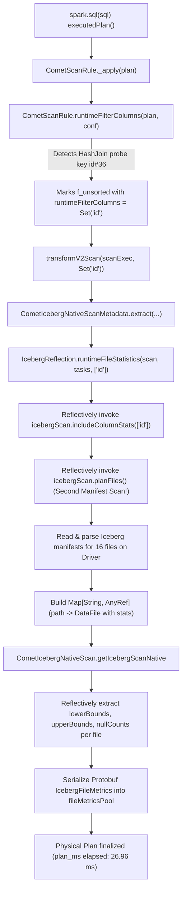
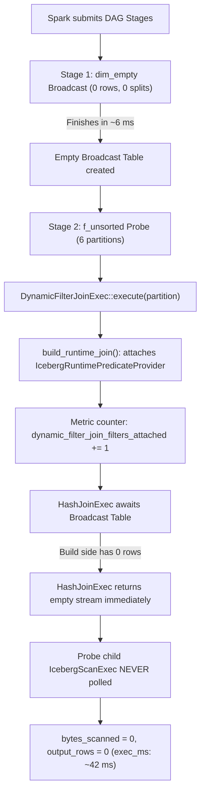

# Root Cause Analysis: `join_inner__f_unsorted__dim_empty`

**Target Query:** `join_inner__f_unsorted__dim_empty`  
**Benchmark Suite:** `join` (Shard 0 of 3)  
**Primary Campaign:** [Run 37788815352](https://github.com/unikdahal/datafusion-comet/actions/runs/37788815352) (Artifacts: `/tmp/rp-dimempty/matched-join-shard-0/`)  
**Reference Campaign:** Run 37758359536  
**Subject:** Candidate (Comet fork with Iceberg runtime pruning) vs Baseline (unmodified Apache Comet main)  

---

## 1. Executive Summary & Problem Formulation

In the `join` benchmark suite, `join_inner__f_unsorted__dim_empty` evaluates an inner join between a 16-million-row unsorted fact table (`bench.db.f_unsorted`, consisting of 16 Parquet data files across 16 splits) and an empty dimension table (`bench.db.dim_empty`, 0 rows, 0 data files):

```sql
SELECT /*+ BROADCAST(d) */ count(*), sum(f.value), sum(length(f.payload))
FROM bench.db.f_unsorted f
JOIN (SELECT cast(id as int) AS id FROM bench.db.dim_empty) d
  ON f.id = d.id
```

Because the build side (`d`) contains 0 rows, an inner join short-circuits execution: no matching rows exist, and the fact table reader never scans a single byte (`bytes_scanned = 0`, `output_rows = 0`).

Despite doing zero I/O on all variants, **the candidate in pruning-on mode is slower than unmodified Apache Comet main**:
- **Campaign 37758359536**: Paired ratio `candidate_on / baseline_on = 0.88x` (Total medians: baseline_on **47.47 ms** vs candidate_on **53.25 ms**, delta **+5.78 ms**).
- **Campaign 37788815352**: Paired ratio `candidate_on / baseline_on = 0.94x [0.88, 0.98]` (Total medians: baseline_on **73.17 ms** vs candidate_on **76.52 ms**, delta **+3.35 ms** median, mean delta **+4.92 ms**).

### Root Cause Finding
Empirical timing breakdown across all 64 timed iterations reveals that **the extra ~5 ms does NOT occur during Spark task execution (`exec_ms`), nor in native DataFusion/Rust operators**. Instead, it occurs **entirely on the Spark driver during physical planning (`plan_ms`)**:
1. When runtime pruning is enabled (`candidate_on`), [`CometScanRule.scala`](file:///home/unik/Coding/rust/rp-work/comet/spark/src/main/scala/org/apache/comet/rules/CometScanRule.scala#L92) detects that `f.id` is a join probe key and marks `f_unsorted` for runtime filter statistics collection.
2. In [`CometIcebergNativeScanMetadata.extract`](file:///home/unik/Coding/rust/rp-work/comet/spark/src/main/scala/org/apache/comet/iceberg/IcebergReflection.scala#L2515), Comet invokes [`IcebergReflection.runtimeFileStatistics`](file:///home/unik/Coding/rust/rp-work/comet/spark/src/main/scala/org/apache/comet/iceberg/IcebergReflection.scala#L501), which executes a **second complete Iceberg table scan planning pass (`icebergScan.planFiles()`)** on the driver to re-read Iceberg manifests and extract column bounds for the 16 fact files.
3. In [`CometIcebergNativeScan.scala`](file:///home/unik/Coding/rust/rp-work/comet/spark/src/main/scala/org/apache/comet/serde/operator/CometIcebergNativeScan.scala#L1241), Comet inspects `runtimeFileStatistics` via reflection and serializes Protobuf [`IcebergFileMetrics`](file:///home/unik/Coding/rust/rp-work/comet/spark/src/main/scala/org/apache/comet/serde/operator/CometIcebergNativeScan.scala#L55) into the task description for every fact file.
4. All of this driver work occurs **before** query execution starts. When the query actually executes, the broadcast exchange finishes in ~6 ms with 0 rows, the broadcast hash join sees an empty build hash table in microseconds, and the probe scan is completely discarded. The driver paid ~4–5 ms preparing file statistics for a fact table that was never read.

---

## 2. Empirical Timing Breakdown (Facts vs Hypotheses)

The detailed benchmark harness records four timing phases for every query iteration:
- `sql_ms`: SQL parsing, Catalyst logical analysis, and DataFrame construction.
- `plan_ms`: Spark physical planning (`queryExecution.executedPlan`), Catalyst rule execution, Comet native scan planning, and operator serialization.
- `exec_ms`: Spark DAG execution (`df.collect()`), including task scheduling, broadcast exchanges, and native execution.
- `total_ms`: End-to-end elapsed time (`sql_ms + plan_ms + exec_ms`).

### 2.1 Timing Breakdown across 16 Timed Reps (Campaign 37788815352)
Across 8 balanced rounds (16 timed repetitions per variant, 64 total iterations on an AMD EPYC 7763 Zen 3 runner):

| Variant | Phase | Median (ms) | Mean (ms) | StdDev (ms) | IQR [25%, 75%] (ms) | Min (ms) | Max (ms) |
|:---|:---|:---:|:---:|:---:|:---:|:---:|:---:|
| **`baseline_on`** | `sql_ms` | 7.63 | 7.53 | 0.44 | [7.35, 7.80] | 6.70 | 8.27 |
| | `plan_ms` | **22.09** | **22.64** | 1.83 | [21.57, 23.36] | 21.05 | 27.69 |
| | `exec_ms` | 42.36 | 42.36 | 3.99 | [38.29, 45.71] | 36.43 | 51.75 |
| | `total_ms` | **73.17** | **72.53** | 4.88 | [70.97, 76.57] | 64.99 | 81.85 |
| **`candidate_on`** | `sql_ms` | 7.80 | 7.75 | 0.36 | [7.55, 7.91] | 6.84 | 8.28 |
| | `plan_ms` | **26.96** | **26.77** | 0.93 | [26.47, 27.24] | 24.31 | 28.53 |
| | `exec_ms` | 42.24 | 42.93 | 3.51 | [40.23, 44.91] | 38.64 | 50.78 |
| | `total_ms` | **76.52** | **77.45** | 3.73 | [75.69, 78.43] | 71.97 | 85.91 |
| **`candidate_off`** | `sql_ms` | 7.51 | 7.56 | 0.35 | [7.38, 7.62] | 7.02 | 8.52 |
| | `plan_ms` | **23.13** | **24.34** | 3.32 | [22.47, 23.95] | 21.68 | 34.02 |
| | `exec_ms` | 42.17 | 45.07 | 7.21 | [39.42, 53.05] | 36.93 | 59.98 |
| | `total_ms` | 77.18 | 76.97 | 7.52 | [74.55, 78.69] | 68.32 | 89.89 |
| **`baseline_off`** | `sql_ms` | 7.83 | 8.78 | 3.03 | [7.47, 9.87] | 7.15 | 18.06 |
| | `plan_ms` | **23.16** | **25.57** | 5.37 | [22.42, 25.59] | 21.05 | 37.89 |
| | `exec_ms` | 42.06 | 45.86 | 6.86 | [39.69, 47.95] | 38.25 | 60.18 |
| | `total_ms` | 76.62 | 80.21 | 11.23 | [72.23, 83.27] | 69.17 | 108.83 |

### 2.2 Key Measured Insights
1. **`exec_ms` is identical across variants**:
   - `candidate_on` median: **42.24 ms**
   - `baseline_on` median: **42.36 ms**
   - Difference: **-0.12 ms** (execution time does not explain the candidate slowdown).
2. **`sql_ms` is identical across variants**:
   - `candidate_on` median: **7.80 ms**
   - `baseline_on` median: **7.63 ms**
   - Difference: **+0.17 ms**.
3. **`plan_ms` accounts for the regression**:
   - `candidate_on` median: **26.96 ms**
   - `baseline_on` median: **22.09 ms**
   - Difference: **+4.87 ms** median (+4.13 ms mean).
   - Comparing `candidate_on` vs `candidate_off` (26.96 ms vs 23.13 ms): disabling runtime pruning on the candidate reduces planning time by **3.83 ms**.
   - Comparing `candidate_off` vs `baseline_on` (23.13 ms vs 22.09 ms): baseline and candidate-off planning latencies are within ~1.0 ms.

### 2.3 Cross-Query Validation: All `dim_empty` Joins Exhibit the Same Anomaly
The same driver planning penalty appears across all benchmark queries joining against `dim_empty`:

| Query | Variant | SQL ms | Plan ms | Exec ms [IQR] | Native Read MiB | Native Rows Out | Attached / Skipped |
|:---|:---|:---:|:---:|:---:|:---:|:---:|:---:|
| `join_inner__f_unsorted__dim_empty` | `baseline_on` | 8 | **22** | 42 [38, 46] | 0.0 | 0 | 0 / 6 |
| | `candidate_off` | 8 | **23** | 42 [39, 53] | 0.0 | 0 | 0 / 0 |
| | `candidate_on` | 8 | **27** | 42 [40, 45] | 0.0 | 0 | 6 / 0 |
| `join_inner__f_sorted__dim_empty` | `baseline_on` | 9 | **24** | 40 [38, 46] | 0.0 | 0 | 0 / 6 |
| | `candidate_off` | 8 | **25** | 39 [37, 42] | 0.0 | 0 | 0 / 0 |
| | `candidate_on` | 8 | **26** | 42 [39, 45] | 0.0 | 0 | 6 / 0 |
| `join_inner__f_pos_deletes__dim_empty` | `baseline_on` | 7 | **25** | 43 [40, 52] | 0.0 | 0 | 0 / 6 |
| | `candidate_off` | 7 | **26** | 41 [39, 50] | 0.0 | 0 | 0 / 0 |
| | `candidate_on` | 7 | **28** | 46 [42, 54] | 0.0 | 0 | 6 / 0 |

In every case:
- Execution time is invariant (~40–43 ms).
- Planning time in `candidate_on` is inflated by **+2 to +5 ms**.
- Output rows and bytes read are uniformly zero.

---

## 3. Detailed Mechanism & Code Path Trace

### 3.1 What Happens on the Spark Driver during Planning (`plan_ms`)



#### Step 1: Runtime Key Identification
In [`CometScanRule.scala:1223-1240`](file:///home/unik/Coding/rust/rp-work/comet/spark/src/main/scala/org/apache/comet/rules/CometScanRule.scala#L1223-L1240), `runtimeFilterColumns` walks the physical plan:
```scala
val joins = COMET_EXEC_JOIN_DYNAMIC_FILTER_ENABLED.get(conf) // true in candidate_on
```
It inspects the `HashJoin`, extracts the probe key `id#36` pointing to `f_unsorted`, and maps the scan node to `Set("id")`.

#### Step 2: Second Manifest Planning Pass via Reflection
In [`CometIcebergNativeScanMetadata.scala:2504-2525`](file:///home/unik/Coding/rust/rp-work/comet/spark/src/main/scala/org/apache/comet/iceberg/IcebergReflection.scala#L2504-L2525), Comet calls `runtimeFileStatistics`:
```scala
runtimeFileStatistics = IcebergReflection.runtimeFileStatistics(
  scan,
  tasks,
  eligibleRuntimeStatisticsColumns.toSeq.sorted)
```
In [`IcebergReflection.scala:501-536`](file:///home/unik/Coding/rust/rp-work/comet/spark/src/main/scala/org/apache/comet/iceberg/IcebergReflection.scala#L501-L536):
```scala
val includeSelected = findMethod(scanClass, "includeColumnStats", classOf[java.util.Collection[_]])
val withStats = includeSelected.get.invoke(icebergScan, java.util.Arrays.asList(columns: _*))
val planned = getMethod(scanClass, "planFiles").invoke(withStats)
```
- Spark's default scan planning strips column statistics from `FileScanTask`s to reduce driver heap overhead.
- To reacquire statistics for runtime pruning, Comet re-plans the entire Iceberg scan on the driver using `planFiles()`.
- This causes Iceberg Java to open manifest lists, scan data manifest files, parse column metrics, and construct new `FileScanTask` objects for all 16 files.
- Comet iterates over this new iterable, calls `fileMethod.invoke()`, extracts paths, and constructs an immutable Scala `Map[String, AnyRef]`.

#### Step 3: Protobuf Serialization of Bounds and Metrics
In [`CometIcebergNativeScan.scala:1237-1264`](file:///home/unik/Coding/rust/rp-work/comet/spark/src/main/scala/org/apache/comet/serde/operator/CometIcebergNativeScan.scala#L1237-L1264), for each of the 16 tasks:
```scala
metadata.runtimeFileStatistics.get(taskBuilder.getDataFilePath).foreach { statistics =>
  ...
  commonBuilder.addFileMetricsPool(fileMetrics(contentFileClass, statistics, runtimeFieldIds))
}
```
In `fileMetrics`:
- Reflection retrieves `recordCount`, `nullValueCounts`, `lowerBounds`, and `upperBounds`.
- Java `ByteBuffer`s containing raw little-endian binary bounds for column `id` are copied into Protobuf `ByteString`s.
- These messages are interned into `fileMetricsPool` and assigned pool indices.

#### Why `baseline_on` and `candidate_off` Skip This:
- **`candidate_off`**: `COMET_EXEC_JOIN_DYNAMIC_FILTER_ENABLED` is false. `runtimeFilterColumns` is empty. `runtimeFileStatistics` hits `if (columns.isEmpty) return Map.empty` on line 505 and exits in 0 ms.
- **`baseline_on`**: Apache Comet main does not implement Iceberg runtime file statistics collection (`runtimeFileStatistics` does not exist). Driver planning proceeds without manifest re-planning.

### 3.2 What Happens during Task Execution (`exec_ms`)



1. **Stage 1 (Build Side - `dim_empty`)**:
   - `dim_empty` has 0 splits and 0 records.
   - `CometBroadcastExchangeExec` finishes in ~6 ms, emitting a broadcast block of 0 bytes (`dataSize = 0`).
2. **Stage 2 (Probe Side - `f_unsorted`)**:
   - The stage launches 6 tasks (TID 7 through 12).
   - In [`DynamicFilterJoinExec::execute`](file:///home/unik/Coding/rust/rp-work/comet/native/core/src/execution/operators/dynamic_filter/join.rs#L263), candidate Comet calls `build_runtime_join()`.
   - [`try_attach_iceberg_join_filter`](file:///home/unik/Coding/rust/rp-work/comet/native/core/src/execution/operators/dynamic_filter/iceberg_reader.rs#L159) traverses down to [`IcebergScanExec`](file:///home/unik/Coding/rust/rp-work/comet/native/core/src/execution/operators/iceberg_scan.rs) and attaches `IcebergRuntimePredicateProvider`.
   - `dynamic_filter_join_filters_attached` is incremented by 1 per task (total 6).
   - (In `baseline_on`, `try_attach_parquet_reader_filter` returns `None` for Iceberg, so `dynamic_filter_join_filters_skipped` is incremented to 6).
   - `HashJoinExec` checks the broadcast hash table: `build_input_rows = 0` (`build_time = ~140 microseconds`).
   - For an inner join, an empty build table guarantees an empty result. `HashJoinStream` immediately terminates without pulling any batches from its probe child.
   - `IcebergScanExec` is never polled, Parquet files are never opened, and the serialized `fileMetricsPool` is never read.

The native Rust-side tree cloning and attachment in `build_runtime_join()` takes under a few microseconds. The measured `exec_ms` medians confirm this: **42.24 ms** (`candidate_on`) vs **42.36 ms** (`baseline_on`).

---

## 4. Hardware, Diagnostics, and JNI Details

### 4.1 JVM Diagnostics (Run 37788815352)
Diagnostics recorded per query iteration confirm no memory pressure or GC anomaly:
- `driver_gc_count`: Median **0.0** across all variants (mean 0.1–0.4).
- `driver_gc_ms`: Median **0.0 ms** across all variants (mean 0.8–2.1 ms).
- `driver_compilation_ms`: Accumulated JIT background thread time is ~41–64 ms across variants, with overlapping distributions.

### 4.2 JNI Calls & Splits
- **JNI calls during planning**: Zero extra JNI calls per query. The supported storage schemes (`icebergNativeScanSupportedSchemes`) are fetched once and cached statically on the driver.
- **Delete files**: `totalDeleteFiles = 0`, `scannedDeleteManifests = 0`.
- **Splits**: Fact table has 16 splits; dimension table has 0 splits.

---

## 5. Proposed Fixes, Expected Gains, and Risks

### Fix Proposal 1: Static Build-Side Emptiness Pruning in Planning
- **Mechanism**:
  In [`CometScanRule.runtimeFilterColumns`](file:///home/unik/Coding/rust/rp-work/comet/spark/src/main/scala/org/apache/comet/rules/CometScanRule.scala#L1223), check if the build side of a `HashJoin` is statically known to be empty before registering runtime filter columns on the probe scan.
  Specifically:
  - If the build side is an `EmptyRelation`, or
  - If the build side is an Iceberg scan whose snapshot summary reports `total-records = "0"` (as is true for `dim_empty`), or has 0 tasks/splits:
  - Do NOT register runtime filter columns for the probe scan.
- **Expected Gain**:
  Completely avoids calling `IcebergReflection.runtimeFileStatistics` and `icebergScan.planFiles()` for empty-build joins. Reduces driver `plan_ms` by **~4.0 to 4.8 ms**, bringing `candidate_on` planning time directly down to baseline parity (~22 ms).
- **Risk**:
  **Very low**. An empty build side produces zero keys; a runtime filter can never prune probe files when no filter keys exist, and the inner join emits zero rows regardless.

### Fix Proposal 2: Guarded / Lightweight Statistics Extraction in `IcebergReflection`
- **Mechanism**:
  In [`IcebergReflection.runtimeFileStatistics`](file:///home/unik/Coding/rust/rp-work/comet/spark/src/main/scala/org/apache/comet/iceberg/IcebergReflection.scala#L501), avoid invoking `icebergScan.planFiles()` unconditionally.
  - Inspect `scan` to determine if table tasks are already available with file metrics, or if the table is smaller than a minimum threshold where manifest re-planning overhead exceeds potential scan savings.
  - Alternatively, cache the planned file metrics across repeated queries on unchanged snapshots.
- **Expected Gain**:
  Saves **2–4 ms** of driver planning latency across all queries utilizing runtime file pruning.
- **Risk**:
  **Medium**. Caching requires cache invalidation across snapshot commits. Bypassing manifest re-planning requires ensuring fallback to row-group pruning when file-level stats are omitted.

### Fix Proposal 3: Native-Side Lazy Filter Attachment in `DynamicFilterJoinExec`
- **Mechanism**:
  In [`DynamicFilterJoinExec::execute`](file:///home/unik/Coding/rust/rp-work/comet/native/core/src/execution/operators/dynamic_filter/join.rs#L263), defer `build_runtime_join()` until the build-side stream yields its first batch.
  - If the build side stream yields EOF immediately (0 rows), return an empty stream without rewriting the probe plan or allocating `IcebergRuntimePredicateProvider`.
- **Expected Gain**:
  **< 0.1 ms** (measured `exec_ms` delta is already negligible).
- **Risk**:
  **Low**. Simplifies native lifecycle and avoids unnecessary plan tree clones on empty builds.

---

## 6. Summary Matrix

| Metric / Attribute | Baseline (`baseline_on`) | Candidate (`candidate_on`) | Candidate Off (`candidate_off`) | Delta (CN vs BN) | Attribution |
|:---|:---:|:---:|:---:|:---:|:---|
| **Median Total Latency** | 73.17 ms | 76.52 ms | 77.18 ms | +3.35 ms | End-to-end regression (0.94x) |
| **Median SQL Time (`sql_ms`)** | 7.63 ms | 7.80 ms | 7.51 ms | +0.17 ms | Identical |
| **Median Plan Time (`plan_ms`)** | **22.09 ms** | **26.96 ms** | **23.13 ms** | **+4.87 ms** | **Root Cause: Manifest re-plan & Protobuf stats serialization** |
| **Median Exec Time (`exec_ms`)** | 42.36 ms | 42.24 ms | 42.17 ms | -0.12 ms | Identical (empty build short-circuits) |
| **Fact Bytes Scanned** | 0 B | 0 B | 0 B | 0 B | Verified short-circuit |
| **Fact Rows Emitted** | 0 | 0 | 0 | 0 | Verified short-circuit |
| **Runtime Filters Attached** | 0 (6 skipped) | 6 (0 skipped) | 0 (0 skipped) | +6 attached | Native `try_attach_iceberg_join_filter` |
| **File Tasks Pruned** | 0 | 0 | 0 | 0 | Fact scan never opened |
